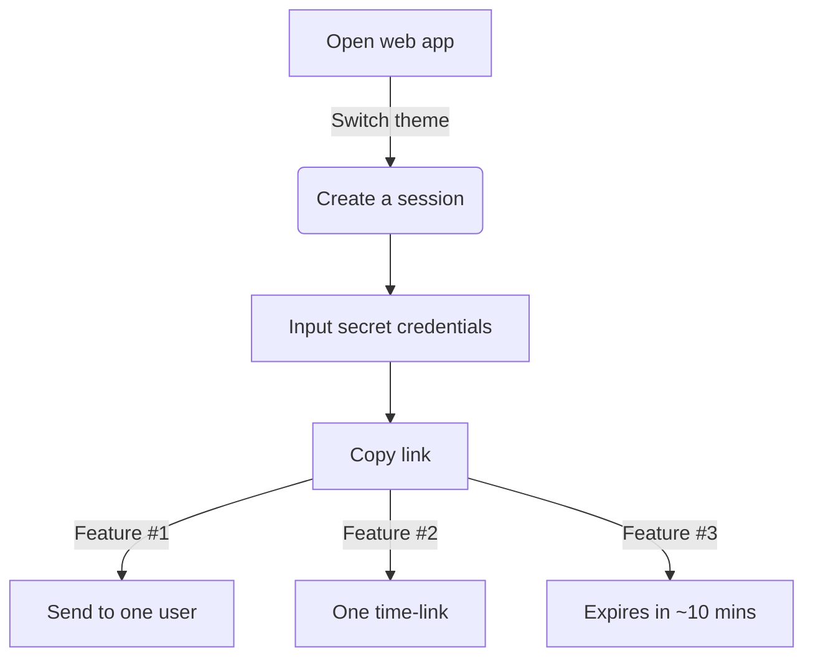
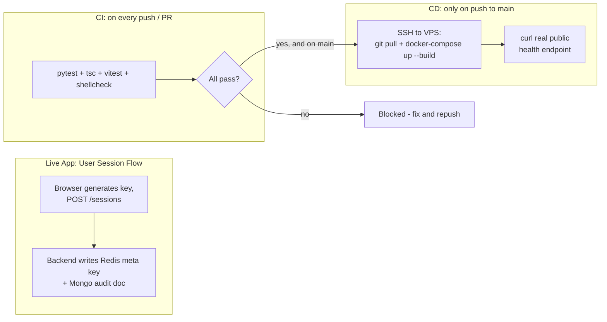

# s(hh)ecrets
The motto is: two can keep a secret if one of them is dead, but no need to be gruesome because your secrets are safe with shhecrets.
## About the Application
In collaborative projects such as hackathons, group projects, tasks and building ideas, the usage of sensitive information is very normal. Whether that be your MySQL server credentials, your API keys, or an entire `.env` file that needs to be shared. To decrease the risk of exposing your information, shhecrets helps to privately pass this information without storing any of it, ensuring your credentials are safe and securely passed over.

> [!TIP]
> Check it out: **https://shhecrets.ca/**

## How It Works

## Project Architecture

